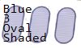
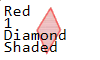
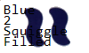
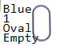
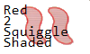

# Game of Set Solver
This program finds patterns in pictures of cards from the game of "Set."

First we find the cards in the image.

Then we determine each card's color, shape, shading, and count.

  

  

  

  

Finally we look through the cards and find matches.

Thanks!

Scott